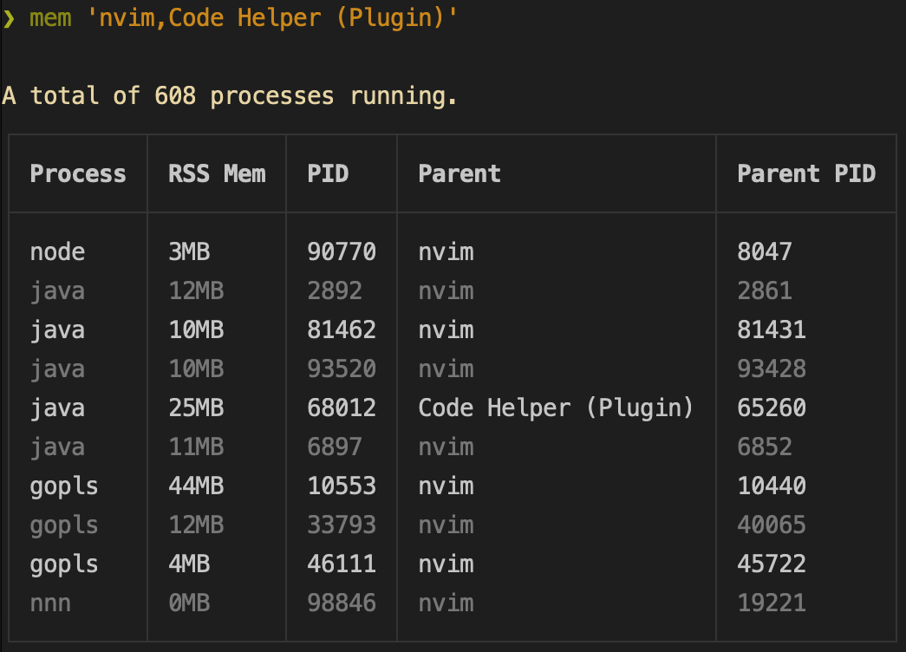

# mem

✨ Overview
---

`mem` gives you a high level overview of the memory used by the children of
processes you're interested in. I primarily wrote it to quickly peek at the
amount of memory being used by LSPs running in multiple instances of neovim on
my computer.

<p align="center">
  
</p>


💾 Installation
---

**go**:

```sh
go install github.com/dhth/mem@latest
```

⚡️ Usage
---

```bash
mem 'nvim,Code Helper (Plugin)'
```
